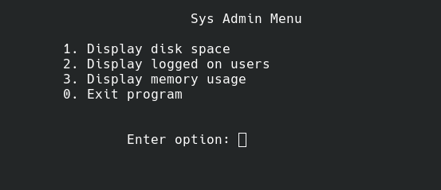
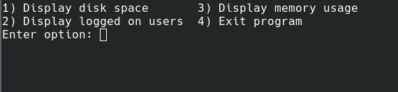

# Bash Cheatsheet

## HereDoc

```bash
[COMMAND] <<[-] 'DELIMITER'
  HERE-DOCUMENT
DELIMITER
```

- The first line starts with an optional command followed by the special redirection operator `<<` and the delimiting identifier.
  - You can use any string as a delimiting identifier, the most commonly used are `EOF` or `END`.
  - If the delimiting identifier is unquoted, the shell will substitute all variables, commands and special characters before passing the here-document lines to the command.
  - Appending a minus sign to the redirection operator `<<-`, will cause all leading tab characters to be ignored. This allows you to use indentation when writing here-documents in shell scripts. Leading whitespace characters are not allowed, only tab.
- The here-document block can contain strings, variables, commands and any other type of input.
- The last line ends with the delimiting identifier. White space in front of the delimiter is not allowed.

```bash
cat << EOF
The current working directory is: $PWD
You are logged in as: $(whoami)
EOF
# Output
# The current working directory is: /path/to/current/directory
# You are logged in as: your_username
```

Instead of displaying the command's output (`cat` in this case) on the screen you can redirect it using the `>`, `>>`, or `|` operators.

```bash
# write ouput of previous command to file.txt
cat << EOF > file.txt
The current working directory is: $PWD
You are logged in as: $(whoami)
EOF
```

```bash
# write heredoc output to sed input
cat <<'EOF' |  sed 's/l/e/g'
Hello
World
EOF
# Output
# Heeeo
# Wored
```

## Process & memory management

### `top`

Dispaly dynamic real-time information about running processes.

| Shortcut | Description              |
| -------- | ------------------------ |
| `h`      | displays help            |
| `q`      | quits                    |
| `f\|F`   | add/remove/sort fields   |
| `<\|>`   | move sort field          |
| `k`      | kill process             |
| `d\|s`   | set update interval      |
| `P, M`   | sort by CPU/memory usage |
| `R`      | reverse sort             |
| `L`      | search for string        |
| `o`      | add filter               |
| `=`      | clear filters            |

### `ps`

Information about running processes.

```bash
# List processes that belong to the current user and are running in the current terminal.
ps

# List all running processes.
ps aux

# List all running process including the full command string:
ps auxww

# List all processes that belong to a specific user in full format.
ps --user $(id -u {{username}}) -f
```

### Linux Process Signals

| Signal | Name   | Description                                     |
| ------ | ------ | ----------------------------------------------- |
| 1      | `HUP`  | Hang up                                         |
| 2      | `INT`  | Interrupt                                       |
| 3      | `QUIT` | Stop running                                    |
| 9      | `KILL` | Unconditionally terminate                       |
| 11     | `SEGV` | Segment violation                               |
| 15     | `TERM` | Terminate if possible                           |
| 17     | `STOP` | Stop unconditionally but don't terminate        |
| 18     | `TSTP` | Stop or pause but continue to run in background |
| 19     | `CONT` | Resume execution after `STOP` or `TSTP`         |

## Filesystem commands

### Finding information about block devices

```bash
lsblk
# SATA and SCSI devices start `sd`
# SSD devices start `nvme`
# IDE devices start `hd`
# you can also list the files under /dev/ to see all devices
```

### Creating partitions

```bash
# Creates a new partition; Can't extend a partition
fdisk
gdisk
# Creates a new partition; Can extend a partition
parted
```

### Creating a filesystem

````bash
mkfs.ext2, mkfs.ext3, mkfs.ext4        # create an ext2/3/4 filesystem
mkfs.fat                               # create a FAT filesystem
mkfs.ntfs                              # create a NTFS filesystem
### `mount`

**Mounts a filesystem or lists mounted filesystems**.

```bash
# show all mounted filesystems
mount

# show mounted filesystems of a specific filesystem type
mount -t {{iso9660|ext4|vfat|fuseblk}}

# mount a device to a directory
mount -t {{filesystem_type}} {{path/to/device_file}} {{path/to/target_directory}}
````

### `umount`

**Unmounts a filesystem.**

```bash
# unmount a filesystem
umount {{path/to/target_directory|path/to/device_file}}
```

### Check and repair filesystems

```bash
# Does not work on NTFS
fsck
```

### `df`

**Gives an overview of the disk space usage.**

```bash
# Display all filesystems and their disk usage:
df

# Display all filesystems of type ext4 and fat32 and their disk usage:
df -t ext4 -t fat32
```

### `du`

**Estimate and summerize file and directory space usage.**

```bash
# List the sizes of a directory and its subdirectories, possibly in (B/KB/MB)
du [-{{b|k|m}}] {{path/to/directory}}

# Show the size of a singly directory, in human readable units:
du -sh {{path/to/directory}}

# List the human-readable size of all .jpg files in subdirectories of the current directory, and show a total at the end:
du -ch */*.jpg
```

## Snap

```bash
# List all snap packages
snap list

# Find a snap package
snap find {{package_name}}

# Install a snap package
snap install {{package_name}}

# Update a package
snap refresh {{package_name}}

# Update all packages
snap refresh

# Uninstall a package
snap remove {{package_name}}
```

## Command Substitution

Command Sustitution allows you to put the output of a command directly into a variable.

There are two methods of command substitution:

```bash
# The first method is to use the `$(here_goes_the_command)` syntax.
var=$(ls -l)

# The second method uses backticks `here_goes_the_command`.
var=`ls -l | sed 's/ /_/g'`
```

## Input/Output Redirection

```bash
# Redirect standard output to a file
echo "Hello World" > file.txt   # creates a file or overwrites an existing file
echo "Hello World" >> file.txt # creates a file or appends to an existing file

# Redirect file output to command standard input
wc < file.txt           # reads file and feeds it to wc

# Redirect standard error to a file
ls -l /etc/passwd 2> error.txt

# Redirect standard output and standard error to a file
# This is equivalent to 1> log.txt 2>&1
# Note that 2>&1 1> log.txt is not correct because when stderr is redirected to stdout, still doesn't point to log.txt
ls -l /etc/passwd &> log.txt

# hide error and/or stdandar output
ls -l /etc/passwd > /dev/null

# Create additional file descriptors
exec 3> file.txt
echo "Hello World" >&3

# Redirecting file descriptors and restore them
exec 3>&1 # keep a copy of stdout
exec 1> file.txt # redirect stdout to file

echo "Hello World" # writes to file.txt
echo "More Hello World" # writes to file.txt

exec 1>&3 # restore stdout to original

echo "Hello World" # writes to terminal

```

## Pipelines

Internally, bash opens a sub-shell for each command in a pipeline.
Keep in mind that sub-shells have access to a copy of all the parent's shell variables and functions (exported or not). Any changes the sub-shell makes is lost to the parent shell.

```bash
# pipe output of ls to input of sort
ls -a | sort

# pipe standard and error output of ls to input of sort
# this is equivalent to 2>&1 |
ls -a |& sort
```

## Arithmetic Expansion

```bash
# anything inside $(()) is arithmetically evaluated and the result is substiuted
echo $((3+4))

# combination of command sub-shell and arithmetic expansion
echo $(($(echo 3+4)*2))

# $[] is the old format arithmetic expansion and will be removed in the future
echo $[3+4]
```

## Conditionals

**Note:** `[[` is actually a command/programm that has an exit code of 0 or one based on the evaluation of the expression. Any program that obeys the same logic, like base utils such as `grep` or `ping`, can be used in its stead.

### string comparisons

| Condition                        | Description                    |
| -------------------------------- | ------------------------------ |
| `[[ -z "$string" ]]`             | empty string                   |
| `[[ -n "$string" ]]`             | non-empty string               |
| `[[ "$string1" == "$string2" ]]` | string equality                |
| `[[ "$string1" != "$string2" ]]` | string inequality              |
| `[[ "$string" =~ regex ]]`       | regex string match             |
| `[[ "$string1" < "$string2" ]]`  | string comparison less than    |
| `[[ "$string1" > "$string2" ]]`  | string comparison greater than |

### integer comparisons

| Condition                   | Description                      |
| --------------------------- | -------------------------------- |
| `[[ "$int1" -eq "$int2" ]]` | integer equality                 |
| `[[ "$int1" -ne "$int2" ]]` | integer inequality               |
| `[[ "$int1" -lt "$int2" ]]` | integer less than                |
| `[[ "$int1" -gt "$int2" ]]` | integer greater than             |
| `[[ "$int1" -le "$int2" ]]` | integer less than or equal to    |
| `[[ "$int1" -ge "$int2" ]]` | integer greater than or equal to |

The `(( ))` construct also allows a range of integer and bitwise operations as discussed in "Arithmetic Expansion" in addition to integer comparisons.

| Condition                  | Description                      |
| -------------------------- | -------------------------------- |
| `(( "$int1" == "$int2" ))` | integer equality                 |
| `(( "$int1" != "$int2" ))` | integer inequality               |
| `(( "$int1" < "$int2" ))`  | integer less than                |
| `(( "$int1" > "$int2" ))`  | integer greater than             |
| `(( "$int1" <= "$int2" ))` | integer less than or equal to    |
| `(( "$int1" >= "$int2" ))` | integer greater than or equal to |
| `(( int++ ))`              | post-increment                   |
| `(( int-- ))`              | post-decrement                   |
| `(( ++int ))`              | pre-increment                    |
| `(( --int ))`              | pre-decrement                    |
| `(( int1*int2 ))`          | integer multiplication           |
| `(( int1/int2 ))`          | integer division                 |
| `(( int1%int2 ))`          | integer modulus                  |
| `(( int1**int2 ))`         | integer exponentiation           |
| `(( int1&int2 ))`          | bitwise AND                      |
| `(( int1 \| int2 ))`       | bitwise OR                       |
| `(( int1^int2 ))`          | bitwise XOR                      |
| `(( int1<<int2 ))`         | bitwise left shift               |
| `(( int1>>int2 ))`         | bitwise right shift              |

**Note:** `((` syntax introduces indirection.

### File comparisons

| Condition                    | Description                 |
| ---------------------------- | --------------------------- |
| `[[ -e "$file" ]]`           | file exists                 |
| `[[ -d "$file" ]]`           | file is a directory         |
| `[[ -f "$file" ]]`           | file is a regular file      |
| `[[ -h "$file" ]]`           | file is a symbolic link     |
| `[[ -p "$file" ]]`           | file is a named pipe (FIFO) |
| `[[ -r "$file" ]]`           | file is readable            |
| `[[ -w "$file" ]]`           | file is writable            |
| `[[ -s "$file" ]]`           | file size > 0 bytes         |
| `[[ -x "$file" ]]`           | file is executable          |
| `[[ "$file1" -nt "$file2"]]` | file1 is more recent        |
| `[[ "$file1" -ot "$file2"]]` | file1 is less recent        |
| `[[ "$file1" -ef "$file2"]]` | file1 is the same as file2  |

### Logical operators

| Operator                 | Description |
| ------------------------ | ----------- |
| `[[ expr1 && expr2 ]]`   | logical And |
| `[[ expr1 \|\| expr2 ]]` | logical Or  |
| `[[ ! expr ]]`           | logical Not |

### Misc

| Comparison          | Description   |
| ------------------- | ------------- |
| `[[-o "$optnmae"]]` | option is set |

### Examples

```bash
# string
if [[ -z "$string" ]]; then
  echo "String is empty"
elif [[ -n "$string" ]]; then
  echo "String is not empty"
else
  echo "This never happens"
fi

# integer
if [[ "$int1" -eq "$int2" ]]; then
  echo "int1 is equal to int2"
elif [[ "$int1" -gt "$int2" ]]; then
  echo "int1 is greater than int2"
else
  echo "int1 is less than int2"
fi

# file
if [[ -e "$file" ]]; then
  echo "file exists"
fi
```

_Keep in mind that there must be a space between the brackets and the condition_

## Loops

```bash
# basic for loop
for file in /path/to/files/*; do
  echo "$file"
done

# C-like for loop
for (( i=0; i<10; i++ )); do
  echo "i is $i"
done

# ranges
for i in {1..10}; do
  echo "i is $i"
done

for i in {1..10..2}; do
  echo "i is $i"
done

# reading from stdin
IFSOLD=$IFS
IFS=$'\n'
cat file.txt | while read line; do
  echo "$line"
done
IFS=$IFSOLD
```

### redirecting the output of loops

```bash
for line in "$file.txt"; do
  echo "$line"
done> output.txt
```

## Variables

### Arrays

```bash
# Creating an array
nums=("zero" "one" "two" "three")
# alternatively
nums[0]="zero"
nums[1]="one"
nums[2]="two"
nums[3]="three"

# Accessing an array
echo "${nums[0]}"           # Element #0
echo "${nums[-1]}"          # Last element
echo "${nums[@]}"           # All elements, space-separated
echo "${#nums[@]}"          # Number of elements
echo "${#nums}"             # String length of the 1st element
echo "${#nums[3]}"          # String length of the Nth element
echo "${nums[@]:3:2}"       # Range (from position 3, length 2)
echo "${!nums[@]}"          # Keys of all elements, space-separated

# Modifying an array
nums=("${nums[@]}" "five")          # Push
nums+=('five')                      # Also Push
nums=( ${nums[@]/Ap*/} )            # Remove by regex match
unset nums[2]                       # Remove one item
nums=("${nums[@]}")                 # Duplicate
nums=("${nums[@]}" "${Veggies[@]}") # Concatenate
lines=(`cat "logfile"`)             # Read from file

# Iterating over arrays
for var in "${nums[@]}"; do
  echo "$var"
done

```

## read input

```bash
# using echo and read
echo -n "Enter your name: "
read name

# using read prompt
read -p "Enter your name: " name

# getting first and last name on the same line
read -p "Enter your first and last name: " firstname, lastname
```

The following are simple applications of `getopt`, `getopts`, and a combination of interactive and command-line input.

- [`getopt` example](./read_input/extractwithgetopt.sh)
- [`getopts` example](./read_input/extractwithgetopts.sh)
- [`getopts` with parameters example](./read_input/extractoptsparamswithgetopts.sh)
- [`getopts` combined with interactive example](./read_input/CheckSystems.sh)

## temp files and directories

```bash
# create a temporary file with 4 random characters
mktemp tempfile.XXXX

# create a temporary directory with 4 random characters
mktemp -d tempdir.XXXX

# create a temporary file and store its name in a variable
tempfile=$(mktemp tempfile.XXXX)

```

## using trap

```bash
# list available signals to trap:
trap -l

# list active traps for the current shell:
trap -p

# set a trap on one or more signals
trap 'echo "Caught signal {{SIGHUP}}"' {{SIGHUP}}

# reset named traps to original settings
trap - {{SIGHUP}} {{SIGINT}}
```

### Examples

- [trapping `SIGINT`](./signals/trap_sigint.sh)
- [trapping `EXIT`](./signals/trap_exit.sh)

## background jobs

```bash
# start a background job
# this job will shut down if the parent process is killed
command &

# start a background job that will run even if the shell is closed
# this job will lose access to stdout and stderr and will redirect all ouput to nohup.out
nohub command &

# view status of jobs assigned to the current shell
# + means the default job
# - means the next dfault job
jobs

# view status and PIDs of jobs assigned to the current shell
jobs -l

# restart default job in the background if it has stopped
bg

# restart a job by job number
bg 2

# restart a job in forground
fg 2

# start a job in the background and set its niceness
# nice values are -20 to 19
# for nice values less than 0 you must have super user privileges
nice -n 10 command > command.out &

# renice a job
renice -n 10 -p PIDNumber

```

## functions

### defining and calling functions

```bash
# define a function
function my_function_name {
  # do something
}
# another form of defining a function
my_function_name () {
  # do something
}

# call a function
my_function_name
```

### returning values from functions

```bash
# there a re 3 methods to return a value from a function
# 1. default exit status
my_function () {
  echo "This is a function"
}
my_function
echo "$? is the exit status of my_functions"
echo "it is the exit status of the last command in the function"
echo "you have to immediately retrieve it after the function is called or it will be filled with the exit status of the next command"

# 2. return a value
my_function2 () {
  echo "This is a function"
  return $(( $(date +%s) % 2 ))
}
my_function2
echo "$? is the exit status of my_function2"
echo "it is the returned value of the function"
echo "keep in mind that the return value can only be an integer between 0 and 255"
echo "the next method enables us to return a value of any type from the function"

# 3. writing to the stdout
my_function3 () {
  read -p "Enter a value: " value
  echo $(( value * 2))
}
result=$(my_function3)
echo "the result of my_function3 is $result"
echo "as you can see, bash is smart enough to distinguish between read's prompt and echo"
echo "the first is written to the terminal while the echo output is returned as function output."
echo "this would have been different if we used echo for read's prompt"
```

### using variables in functions

```bash
# bash handles functions as mini-scripts
# passing parameter to functions is like passing them to scripts
my_function () {
  echo "There are $# parameters passed to the function"
  count=1
  for arg in "$@"; do
    echo "parameter $count is $arg"
    count=$(( count + 1 ))
}

my_function one two three four five
# writes:
# "parameter 1 is one"
# "parameter 2 is two"
# ...

# keep in mind that numbered parameters are local to the function
# functions don't have access to the parameters of the calling script

# functions have two types of variables:
# 1. local variables
# 2. global variables

# global variables are the default and global variables declared inside the function can be access from anywhere in the script, as the global variables declared in the script can be accessed from inside the function
my_function2 () {
  echo "This function doubles the 'value' variable declared in the calling script"
  value=$(( value * 2 ))
  echo "The double 'value' is $value"
}
variable=10
my_function2

# we can make all the variables the are only needed inside the function local to the function
# local variabels are created by the use of the local keyword
local value=10


# passing in arrays to functions is slightly more complicated
function test_array () {
  echo "The parameters are: $@"
  thisarray=$1
  echo "The received array is ${thisarray[*]}"
}
myarray=(1 2 3 4 5)
echo "The original array is: ${myarray[*]}"
test_array $myarray

# will output:
# The original array is: 1 2 3 4 5
# The parameters are: 1
# the received array is 1

# the following method is used to pass arrays to functions
function test_array2 () {
  local newarray
  newarray=( $(echo "$@") )
  echo "The new array value is: ${newarray[*]}"
}

myarray=(1 2 3 4 5)
echo "The original array is: ${myarray[*]}"
test_array2 ${myarray[*]}

# will output:
# The original array is: 1 2 3 4 5
# The new array value is: 1 2 3 4 5


# returning an array from a function follows a similar technique
function arraydblr () {
        local new_array=( $(echo "$@") )
        local num_elements=$(( $# - 1 ))

        for (( i = 0; i <= num_elements; i++ ))
        {
                new_array[$i]=$(( new_array[$i] * 2 ))
        }
        echo ${new_array[*]}
}

myarray=(1 2 3 4 5)
echo "The original array is: ${myarray[*]}"
arg1=$(echo ${myarray[*]})
result=( $( arraydblr $arg1 ) )
echo "The new array is: ${result[*]}"

# example recursive function
function factorial () {
  if [[ $1 -eq 1 ]]; then
    echo 1
  else
    local temp=$(( $1 - 1))
    local result=$(factorial $temp)
    echo $(( $1 * $result ))
  fi
}

read -p "Enter a number: " num
result=$(factorial $num)
echo "The result of factorial $num is $result"
```

## sed

The general form of `sed` is as follows: `sed options script file`, while the options are:

| Option        | Description                                                                            |
| ------------- | -------------------------------------------------------------------------------------- |
| `-e commands` | Adds additional sed commands to run while processing the input                         |
| `-f file`     | Adds the commands specified in the file to the commands run while processing the input |
| `-n`          | Doesn't produce output for each command, but waits for the print (p) command           |

The `script` parameter specifies a single command against the data stream. If more than one command is required, you must use either the `-e` option to specify them in the command line or the `-f` option to specify them in a separate file.

```bash
# using `s` to substitute a text string with another
# prints "This is a big test"
echo "This is a test" | sed 's/test/big test/'

# reads data1.txt and substitutes "dog" with "cat".
# writing the modified output to stdout
sed 's/dog/cat/' ./gawk_sed/data1.txt

# using multiple editor commands in the command line
# each command is applied to every line.
# commands must be separated with a ";"
# there shouldnt' be any space between the preceding command and the ";"
# substitutes "brown" with "red" and "dog" with "cat"
sed -e 's/brown/red/; s/dog/cat' ./gawk_sed/data1.txt

# using the secondary prompt in bash shell
sed -e '
> s/brown/green/
> s/fox/toad/
> s/dog/cat/' ./gawk_sed/data1.txt

# using a script file
# the file contains each command on a seprate line
sed -f script1.sed data1.txt


```

## gawk

`gawk` is a more advanced tool than `sed` for manipulating data in a file. It provides a more programming-like environment allowing the modification and reorganization of data in a file.
Within the `gawk` programming language the following is possible:

- Define variables to store data.
- Use arithmetic and string operators to operate on data
- Use structured programming concepts, such as conditionals and loops to add logic to your data processing.
- Generate formatted reports by exracting data elements within the data file and repositioning them in another order or format.

The basic `gawk` format is as follows: **`gawk`**_`options program file`_
Here's a rundown of the options:

| Option               | Description                                                      |
| -------------------- | ---------------------------------------------------------------- |
| `-F`_`fs`_           | Specifies a file separator for delineating data fields in a line |
| `-f`_`file`_         | Specifies a filename to read the program from                    |
| `-v`_`var = value`_  | Defines a variable and default value used in the `gawk` program  |
| `-L [`_`keyword`_`]` | Specifies the compatibility mode or warning level for `gawk`     |

`gawk` scripts are defined within `{}` blocks. since `gawk` command line assumes that the script is a single text string, you must enclose your script in single quotation marks.

```bash
# Since gawk works on input lines this line prints nothing
# but expect you to type at the prompt
# for each inputted line, it writes "Hello world" to stdout
# regradless of the input
# sending a EOF (Ctrl+D) will terminate the command
gawk '{print "Hello world!"}'
```

One of the primary features of `gawk` is its ability to manipulate data in a file. It does this by automatically assigning a variable to each data element in a line. By default `gawk` has the following variables:
| Variable | Description |
| -------- | ----------- |
| `$0` | The entire line of text |
| `$1` | The first data element in the line |
| `$2` | The second data element in the line |
| `$n` | The nth data element in the line |

Data fields are determined in a text line by a _field separation character_ which is specified by the `-F` option. This option sets the `FS` field. The default field separation character in `gawk` is any whitespace character.

```bash
# considering a text file with words separated by spaces
# the following will print the first word in each line
gawk '{print $1}' ./gawk_sed/data2.txt
```

When the file uses a different field separation character, specify the character using the `-F` option.

```bash
# prints the first field in each line in /etc/passwd
# which is the user namec
gawk -F: `{print $1}` /etc/passwd
```

To use multiple commands in the `gawk` script, separate them with a semicolon.

```bash
# Changes the 4th field and pritns the line
# prints "My name is Christine"
echo "My name is Rich" | gawk '{$4 = "Christine"; print $0}'
```

Using secondary prompt to run the same command as above

```bash
gawk '{
  > $4 = "Christine"
  > print $0}'
My name is Rich
# prints "My name is Christine"
# Note that since we didn't provide a filename, gawk retrieves data
# from stdin. To send EOF to gawk to signal the end of input, press (Ctrl+D)
```

We can also store our `gawk` scripts in a file. This [script](./gawk_sed/script2.gawk) reads the `/etc/passwd` file and prints the user name and the home directory for each user.

```bash
gawk -F: -f ./gawk_sed/script1.gawk /etc/passwd
# prints something similar to the following
# root's home directory is /root
# user1's home directory is /home/user1
# ...
```

By default, `gawk` applies the program script to each line of input. If you want to run something just at the beginning or end of the input, use the `Begin {}` and `End {}` blocks at the start and end of the script.
This example [script](./gawk_sed/script2.gawk) reads the `/etc/passwd` file and prints the user name and default shell for each user. It adds a header and footer to the output.

```bash
gawk -f script2.gawk /etc/passwd
# prints something similar to the following
# The latest list of users and shells
# UserId          Shell
#--------         ---------
# root             /bin/bash
# daemon           /usr/sbin/nologin
# ...
# This concludes the listing
```

## User management

### `useradd`

```bash
# create a new user
useradd -m {{username}}

# print or change default useradd configuration
useradd -D
```

## Useful special parameters

| Parameter | Description                                 |
| --------- | ------------------------------------------- |
| `$?`      | exit code of the last command               |
| `$*`      | all positional parameters as a single word  |
| `$@`      | all positional parameters as separate words |
| `$#`      | number of positional parameters             |
| `$$`      | expands to the process ID                   |
| `$!`      | PID of the last background process          |
| `$$`      | expands to the process ID of the shell      |
| `$0`      | filename of the current shell               |

## Misc

```bash
# Open last executed command in the default editor
fc

# List all built-in commands
compgen -A builtin
```

## Creating a menu

1- [Simple command based menu](./create_menu/menu1.sh)

2- [Simple command based menu using `select`](./create_menu/menu2.sh)

This method uses the built-in `select` command to display a menu and execute the selected command. It helps to avoid the lengthy `echo` command in the previous method but it gives you less control over the menu which makes it less suitable for long menus. `select` is also bash specific and not available on many other shells. For these reasons it is recommended to use the previous method.
3- [Fancy menus using the `dialog` package](./create_menu/menu3.sh)

4- Some popular windowed options are `zenity` and `gdialog` on GNOME and `kdialog` on KDE.

## Resources

1. [Nice website](https://explainshell.com/) explaining bash commands.
2. [Bash a-z](https://mywiki.wooledge.org/)
3. [Bash spell checker](https://www.shellcheck.net/)
4. [Bash online manual](https://www.gnu.org/software/bash/manual/html_node/)
